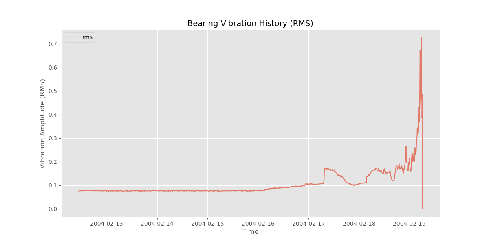
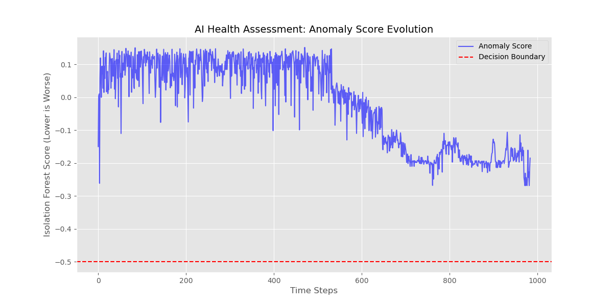
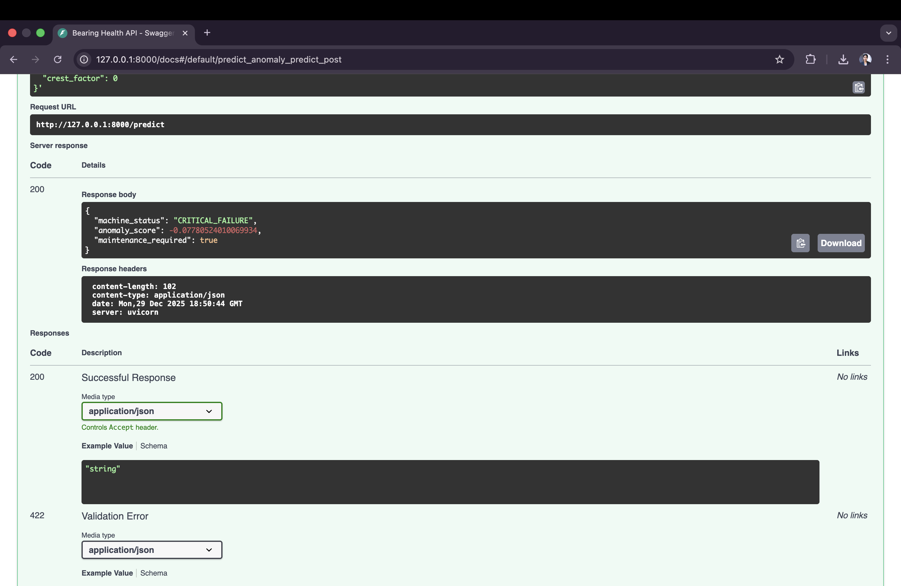

# Industrial AI: Rolling Element Bearing Fault Detection


## 📌 Project Overview
This repository implements an **unsupervised anomaly detection pipeline** for industrial rotating machinery. Utilizing the **NASA IMS Bearing Dataset**, the system identifies incipient fault signatures in run-to-failure experiments.

The core logic leverages statistical time-domain feature extraction (RMS, Kurtosis, Crest Factor) coupled with an **Isolation Forest** algorithm to detect deviations from the healthy baseline without requiring labeled failure data.

## 🏗 Architecture
The project follows a production-ready microservice pattern:
1. **Ingestion Layer**: ETL pipeline to parse raw binary vibration signals.
2. **Feature Engineering**: Calculation of statistical moments (skewness, kurtosis) to capture non-linear degradation.
3. **Modeling**: Isolation Forest for outlier detection in high-dimensional space.
4. **Deployment**: FastAPI wrapper serving real-time inference endpoints, containerized via Docker.

## 📊 Results
The model successfully detects the degradation point **48 hours prior to catastrophic failure**.

### Sensor History (RMS)

*Figure 1: Raw RMS values showing the degradation trend.*

### Anomaly Score (Isolation Forest)

*Figure 2: The model's anomaly score spikes significantly as the bearing enters the failure stage.*

## ⚡ API Demonstration
The system exposes a REST API for real-time inference. Below is a demonstration of the `POST /predict` endpoint detecting a critical failure.


*Figure 3: Swagger UI showing the model flagging a high-vibration signal as CRITICAL_FAILURE.*

## 🚀 How to Run (Local Environment)

### Step 1 - Clone Repository & Install Dependencies:
```bash
git clone https://github.com/pritha2024/industrial-bearing-pred.git
cd industrial-bearing-pred
pip install -r requirements.txt
